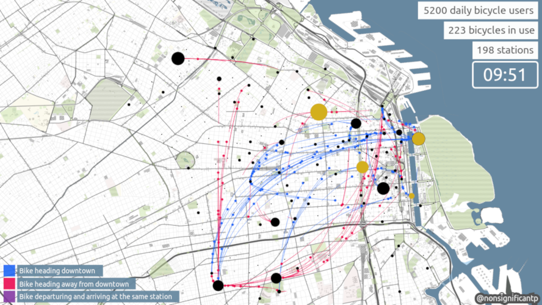

🚲🚲🚲🚲🚲🚲🚲🚲🚲🚲🚲🚲🚲🚲🚲🚲🚲🚲🚲🚲 

# Buenos Aires' Bikesharing system daily use

*by* Agustin Rodriguez

### Summary

An animation powered by P5js that ilustrates flowS between docking stations on an average weekday in *EcoBici*, Buenos Aires own bikesharing system.

## Description

By cloning this repository and executing `index.html` you'll find an animation made with *javascript* and *processing* using P5js library. It shows hourly bicycle flow from the top 10 busiest docking stations to their respective top 5 most common destinations. Each color dot represents a bicycle, black dots represent docking stations.

The life cycle of each bicycle is as follows

1. A bicycle departures from the starting stations.
2. Travels along a path shaped as a quarter of a full circle.
3. Ends up arriving at another docking station. 

Whenever a bicycle arrives at its ending stations, this react by increasing its size and changing color momentarily. The bigger the station dot, the more arrivals per minute. Lastly, bicycle dots come in three possible colors.

1. **Blue dots** for those bicycles heading to the city's downtown (Comuna 1). Downtown includes the neighborhoods of Retiro, San Nicolas, Montserrat, Puerto Madero, Constitucion and San Telmo.
2. **Red dots** for those bicycles heading to stations outside Downtown.
3. **Orange dots** for those bicycle trips where both the starting and ending stations are the same. They follow a circular path around the station.

## Data adquisition

All data is public and comes from Buenos Aires open data initiative website [[1]](https://data.buenosaires.gob.ar/dataset/bicicletas-publicas). The following variables were extracted for generating a simulation of the bikesharing system behavior during an average weekday: Time of departure, time of arrival, trip duration and ID numbers of the starting and ending stations.

Stations geolocation data comes from a separete source in the same webpage [[2]](https://data.buenosaires.gob.ar/dataset/estaciones-bicicletas-publicas). We were able to extract information as district & neiberhood location by using Buenos Aires' API service of reverse geocoding [[3]](http://ws.usig.buenosaires.gob.ar/geocoder/2.2).

## Simulating an average weekday

We used a probabilistic approach of how the system behaves during a weekday using the observed frecuencies found in the data and by assuming a normal distribution of daily bicycle use and trips duration.

Before initializing the visualization, a database of trips is generated by the `engine.js` script. The process goes as follow:

1. A random pick is made from a normal distribution using the observed mean and standard devation of daily number of bicycles used.
2. The previous number is divided in hourly slots in proportions acording with those observed in the yearly data.
3. For each hourly slot, we randomly select a starting station according to its used frecuency, meaning that stations more used on average are more likely to be pick. Once a starting station is selected, we select an ending stations from the top 5 destination corresponding to the starting station. This process is repeated an x number of times defined by how much bicycles were alocated in the respective hourly slot.

## License

This code is licensed under the GNU GENERAL PUBLIC license v3 - see the [LICENSE.md](LICENSE.md) file for details.